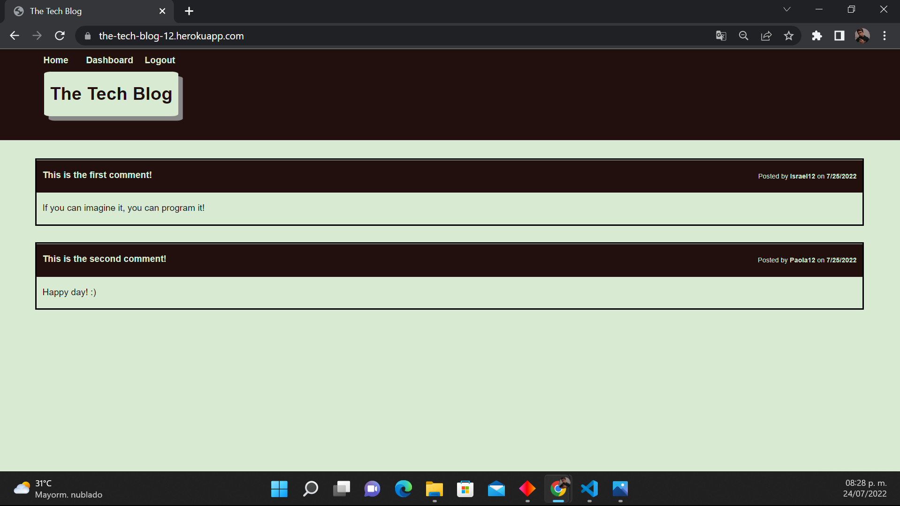
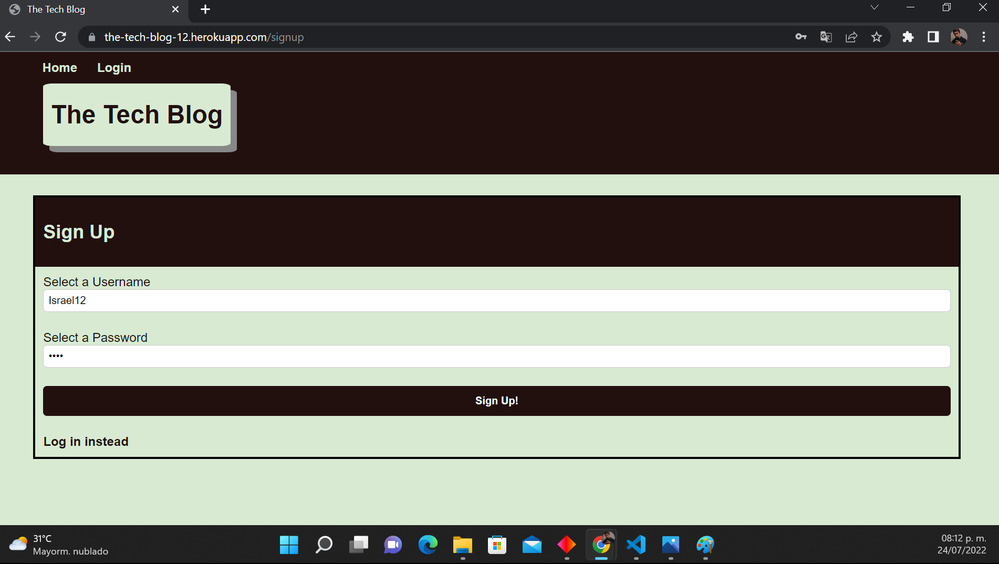
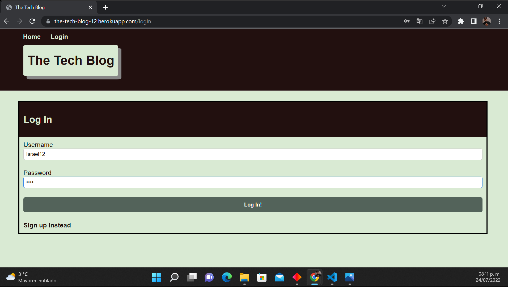
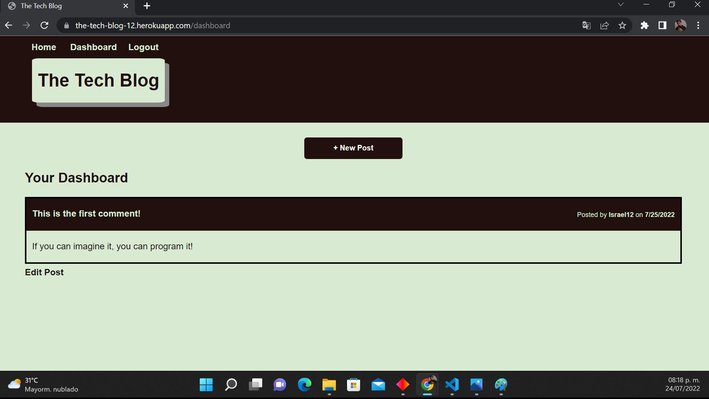
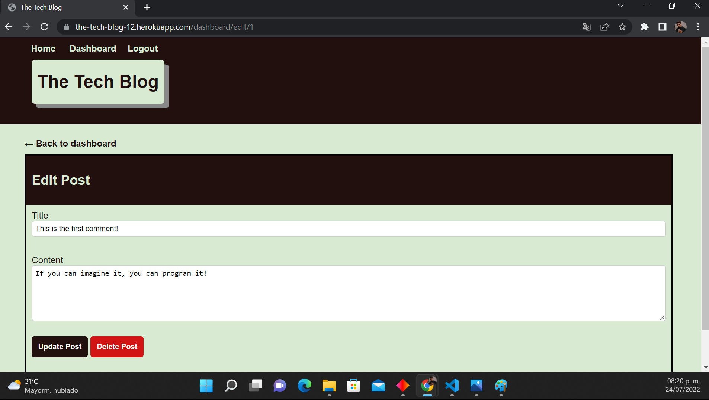
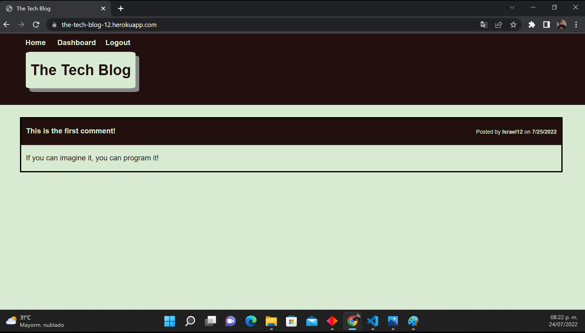
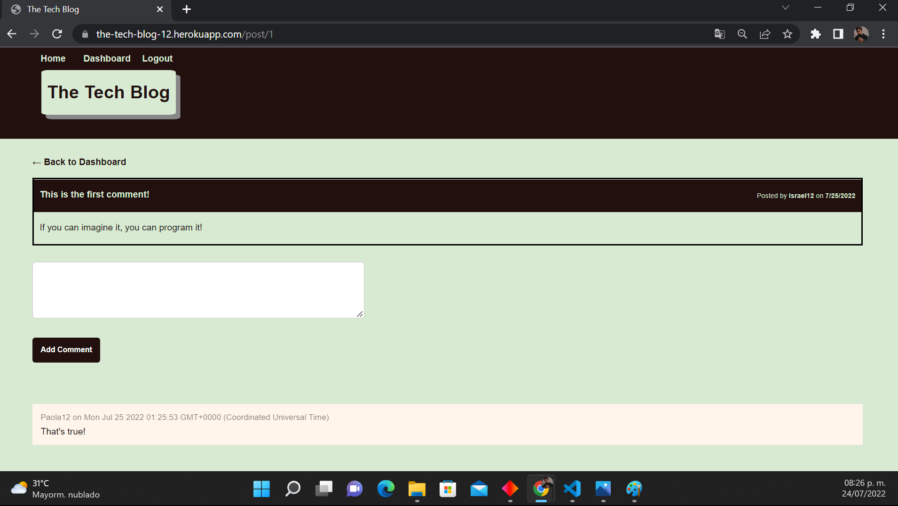

# Tech Blog Challenge

[](https://github.com/israel2800)
[](https://github.com/israel2800/tech-blog-challenge)
[](https://github.com/israel2800/tech-blog-challenge)
[](https://nodejs.org/en/)
[](https://www.npmjs.com/package/inquirer)
[](https://choosealicense.com/licenses/mit/)

## Table of Content
* [ Project Links ](#Project-Links)
* [ Screenshots-Demo ](#Screenshots)
* [ Project Objective ](#Project-Objective)
* [ User Story ](#User-Story)
* [ Technologies ](#Technologies)
* [ Installation ](#Installation)
* [ Usage ](#Usage)
* [ Credits and Reference ](#Credits-and-Reference)
* [ Tests ](#Tests)
* [ Author Contact ](#Author-Contact)
* [ License ](#License)
#

##  Project Links
Website link:
https://the-tech-blog-12.herokuapp.com/

GitHub project:
https://github.com/Israel2800/tech-blog-challenge


## Screenshots-Demo
**Webpage Home:**



**User Sign Up:**



**User Log In:**



**Adding a New Post:**



**Edit and Delete Post options:**



**Submitting the first Post:**



**Comment from another User:**




## Project Objective
Create a web application for all the users that would like to share their tech opinions; they will be able to log in by creating an account and the system will allow the user to add a new post, these posts will be public, where other people can add a comment. Posts can be edited and deleted and users will also have the option to look into their own dashboards!

## User Story
AS A developer who writes about tech, I WANT a CMS-style blog site, SO THAT I can publish articles, blog posts, and my thoughts and opinions

## Technologies 
```
node.js, npm inquirer, JavaScript, CSS, mysql2, Express, dotenv, Handlebars, Sequelize
```

## Installation
Access to the GitHub project and clone or download the project, you can do this by clicking in the green button with the word "Code". If you decided to clone the repo you need to choose one of the SSH/HTTPS keys and copy one, after this you will need to open the terminal of your choice and type "git clone 'key'" you will need to paste one of the two keys you previously select and then click enter. If you decided to download the project you will click in the "Download.zip" option and the project will be downloaded so you will locate the file and do a right-click to select "Extract All" and you can choose where tu place it.

## Usage 
To use this app you will need to download and install the terminal for mac or gitbash for windows. You may also need to install [node.js](https://nodejs.org/en/) and [npm](https://www.npmjs.com/) using the terminal. You will open the project in the code editor of your choice and then open the terminal and type "npm install" or "npm i" to install all the dependencies required. It will be necessary to create a file called ".env" with the following information: "DB_NAME='ecommerce_db' DB_USER='root' DB_PASSWORD='(your password)'" After that is created we are able to run the schema.sql file, for this is necessary to type in the terminal "mysql -u root -p" and then introduce your password, with that done we can type "source db/schema.sql;" and then we are good to quit it typing "quit;". Finally you will be able to start the app typing "npm start" or "node server.js" on your terminal or gitbash. You can see the local website in the following link: http://localhost:3001/

## Credits and Reference
The following links helped me with the project: [mysql2](https://github.com/sidorares/node-mysql2), [handlebars](https://handlebarsjs.com/api-reference/utilities.html#handlebars-utils-isempty-value).

## Tests
npm test

## Author Contact
Contact the author with any questions!<br>
Github link: [Israel2800](https://github.com/israel2800)<br>
Email: dady281100@gmail.com

## License
This project is [MIT](https://choosealicense.com/licenses/mit/) licensed.<br />

Copyright © 2022 [ISRAEL AGUILAR](https://github.com/israel2800)

<hr>
<p align='center'><i>
This README was generated with ❤️ by ISRAEL AGUILAR
</i></p>
